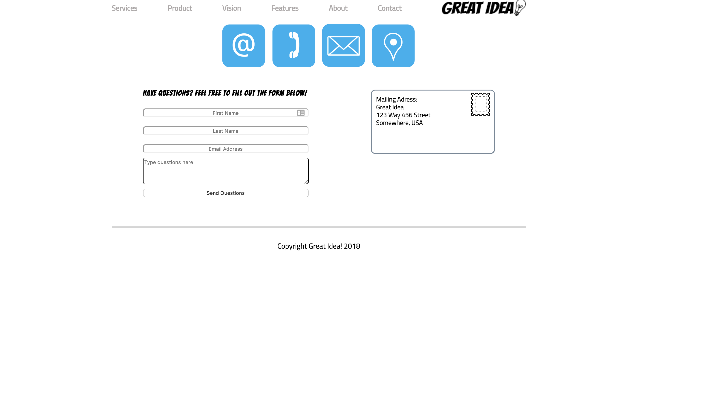
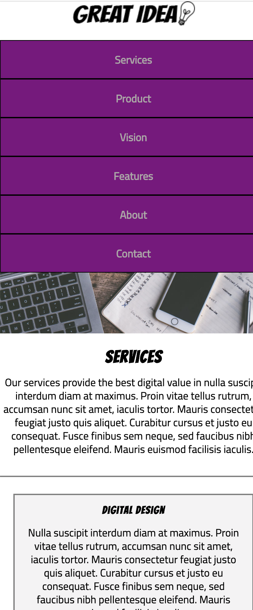
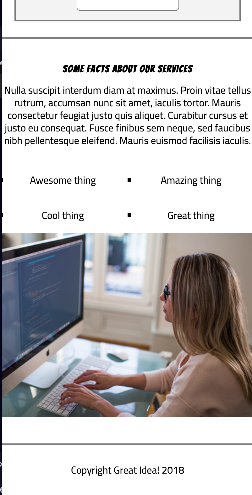
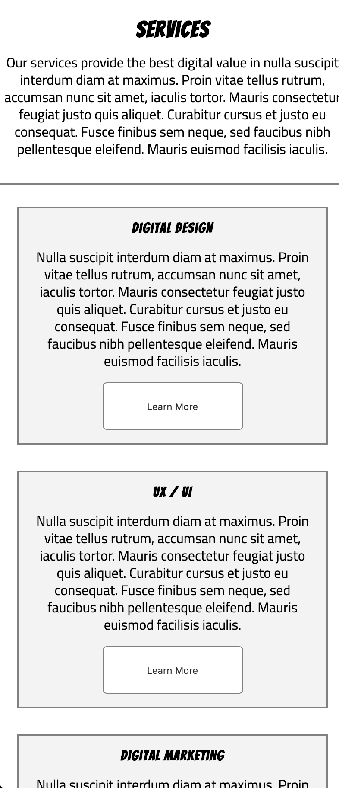

### Feedback on UI-Flexbox-III:

Date: March-6-2019

The base project looks fairly good. My main comments are on your stretch goals. 

 

 1. Great creativity in your choice of design. That being said, it is a bit heavy on graphics on the right side, so I would break it up by left aligning your contact graphic with the start of the form and shrink it a little bit. We don't want to supersede the importance of the logo in the upper righthand corner. This is purely subjective though, so try it and just see what you think. 

 2. If you are going to use forms, I would use Bootstrap forms. Google Bootstrap 4 and follow the documentation to use it in your projects. I'm not sure Lambda covers it in curriculum anymore, but it's super easy to pick up. It'll make your inputs a but more uniform and nice looking. 

 3. Make your footer sticky to the bottom so that it's like your other pages. 

 

 1. At the mobile breakpoint, there is a bit of a weird anomaly going on. Not sure it's exactly what you want but I can see what you are going for! 

  

  Your logo here seems to be centered where you probably want it which is odd when it wasn't that way on your contact page. 

  For UI/UX, anything over two or three lines of text, the rule is to left align it. So I would left align almost everything on this page, including the headlines. I think the nav bar elements are okay. 

   

  As you can see here, we need some padding here too- the black stripe you see here on the side is my desktop

 

Just another example of stuff that needs to be left-aligned. Just a UX rule. :) 

Overall, your execution of the original project was great. All my comments, even are suuuuppppppeeeeer nitpicky. Great job!

